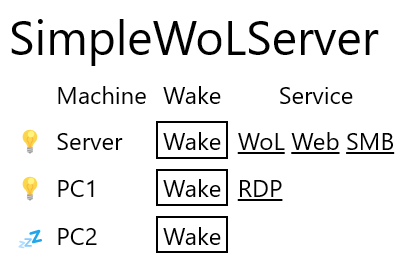

# SimpleWoLServer

Webインタフェースからマジックパケットを飛ばすことができる最低限な機能のWoLサーバです。Bun標準機能だけで作っているのでパッケージのインストールは不要です。

## 使用方法

1. 任意の場所にリポジトリをcloneする
1. Bunをインストールしていなければする
1. [`example.wol-config.json`](./example.wol-config.json)のように記述した設定ファイルを任意の場所に配置する
1. [`example.env`](./example.env)のように設定ファイルの場所を記述したファイルを`.env`という名前でリポジトリのルートに配置する
1. `bun start`で実行する
1. Webブラウザで3000番ポートにアクセスする

## 設定

- `name`: 表示名
- `ping`: ping送信先のアドレス。サーバのpingコマンドで解釈できる値ならなんでもいい。指定しない場合状態が不明になる
- `macAddress`: マジックパケットの送信先のMACアドレス。区切りはなし、`:`、`-`のいずれかで、大文字小文字は問わない。指定しない場合`Wake`ボタンが表示されない
- `services`
    - `name`: リンクの文字列
    - `url`: リンク先。直接リンクとして機能しない文字列をコピペして使う手もある

## 参考情報

Tailscale等でサーバにアクセスできるようにすることで、LAN外からでもサーバを踏み台にしてWoLすることができます。`tailscale serve --bg --http=80 3000`などとするとポート指定が必要なく便利です。

WindowsはWoLで起動した場合、通常の自動スリープがオフになっていても、別の自動スリープが発動してしまいます。回避するには、電源オプションの非表示になっている「システム無人スリープ タイムアウト」を表示させて無効にする必要があります。